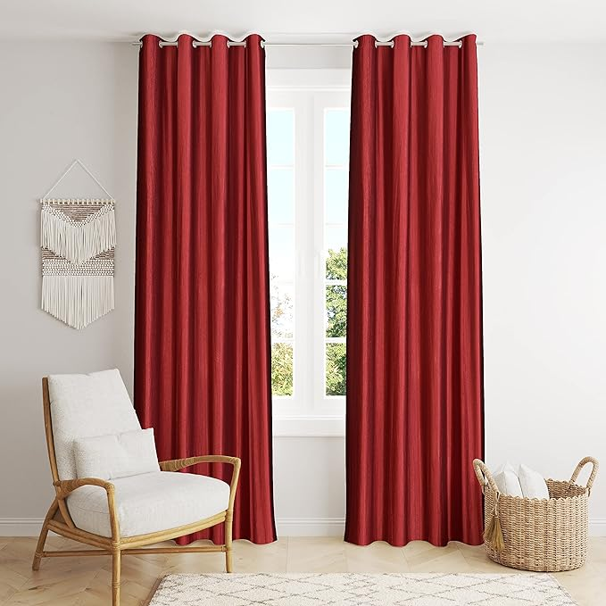

# Displacement of Objects in an image

## Installation
Environment creating
```bash
# Create and activate a new conda environment
conda create -n object-displacement python=3.10 -y
conda activate object-displacement
```
> NOTE: Make sure to use python >= 3.10 as some type hint syntax is available only python 3.10 onwards

Install PyTorch and other dependencies
> NOTE: pytorch-cuda version should ideally match with nvcc --version and should be less than or equal to nvidia-smi version
```bash
# Install PyTorch
conda install pytorch torchvision pytorch-cuda=12.1 -c pytorch -c nvidia -y

# Install SAM (Segment Anything Model) from the official repository
pip install git+https://github.com/facebookresearch/segment-anything.git

# Install other dependencies
pip install -r requirements.txt
```

Download the pretrained SAM model
```bash
# Download SAM checkpoints
mkdir -p checkpoints
cd checkpoints
wget https://dl.fbaipublicfiles.com/segment_anything/sam_vit_b_01ec64.pth -q
```

## Usage
```bash
# To generate the mask for the object
python run.py --image <path-to-image> --output <path-to-output-image> --class <object prompt>

# To displace the object in the image
python run.py --image <path-to-image> --output <path-to-output-image> --class <object prompt> --x <displacement-x> --y <displacement-y>
```
> NOTE: The behavior of the model can be customized by changing the `config.yaml' file

## Approach
1. [SAM](https://ai.meta.com/research/publications/segment-anything/) is used to segment out all objects in the image
2. [CLIP](https://arxiv.org/pdf/2103.00020) is used to identify the object to be displaced based on the class prompt
3. The object is cut and pasted at the desired location to displace it
4. The space surrounding the object (in it's new location) is masked out for a seamless displacement
5. The space left behind by the object is filled with the background color (using nearest neighbor interpolation) and is masked out
6. The space around the original location of the object is masked out as well to prevent any artifacts from appearing in the final step
7. The final image is obtained by using [Stable Diffusion Inpainting](https://huggingface.co/diffusers/stable-diffusion-xl-1.0-inpainting-0.1) to fill in the masked regions

## Results
| Input             |  Prompt | Mask | Displacemennt (x, y) | Output |
:-------------------------:|:-------------------------: | :-------------------------: | :-------------------------: | :-------------------------:
  |  Bagpack |  | (300, 0) | 
  |  Laptop |  | (0, 100) | 
  |  Stool |  |  | 
  |  Basket |  | (-150, -50) | 

> NOTE: Different mask sizes were used for different experiments as they are very dependant on the size of the image and object

## Observations
1. **Bagpack**
    - The model is able to succesfully segment out the correct object in the image
    - The object, after being displaced, is able to blend in with the background
    - The object, originally being cut out, is able to be completed by the model
    - Some artifcats are present in the original location of the object
2. **Laptop**
    - The model is able to succesfully segment out the correct object in the image
    - The object, after being displaced, is able to blend in with the background
    - The model is able to fill in some object, albeit not so well, to help support the hovering laptop

3. **Stool**
    - The model isn't able to succesfully segment out the correct object in the image for some cases
    - 

4. **Wall Hanging**
    - The model is able to succesfully segment out the correct object in the image
    - The object, after being displaced, is able to blend in with the background
    - The model recognizes the view as 3d and is able to displace the object in the correct direction
    - Some artifacts are present in the original location of the object

## Conclusions
- The model has shown good stiching capabilities as shown with completing the bagpack and adding support for the laptop
- The model has shown to understand different views of the object and is able to displace the object in the correct direction
- There is an evident error in the segmentation model, as shown with the stool example. This is due to the segmented out object, without any context of it's surrounding is able to convince the CLIP model about it's class
- Segmented regions, which contain an object of the class within it's boundaries (even though are masked out) are detected positively by clip
- The inpainting model is able to fill in the masked regions, but some artifacts are present in the final image. These artificats can be removed by providing a better suiting prompt in the config file. (This has not been modified)

## Future Work
1. Using recent advancements in open-vocabulary image segmentation for the segmentation step to improve the speed of mask generation. The current method although very accurate is slow
2. Using [Diffusion Self-Guidance](https://arxiv.org/abs/2306.00986) for end to end object displacement. This method alleviates the need for all the intermediate steps (including the segmentation step) and can be used to directly displace the object in the image. This approach is based on the idea that cross-attention maps in the diffusion denoiser contains location information of the objects in the image as shown [here](https://arxiv.org/abs/2208.01626) and [here](https://pnp-diffusion.github.io/) and using these maps as classifier guidance can be used to displace objects in the image
3. Using [Object Stich](https://arxiv.org/abs/2212.00932) to improve the object pasting step. This method is able to stich objects in the image in a more realistic and context aware manner. It has also shown capabilities of shadow generation and object blending
4. [DragDiffusion](https://arxiv.org/abs/2208.01626) has shown capabilities of object displacement in the image